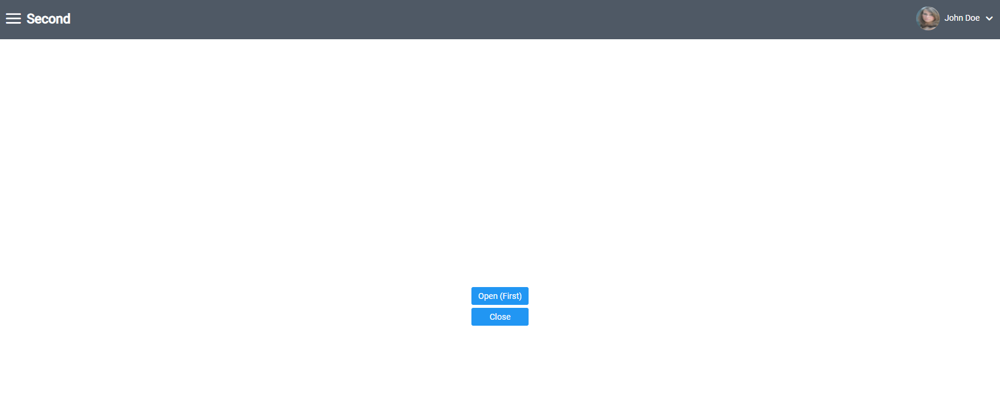
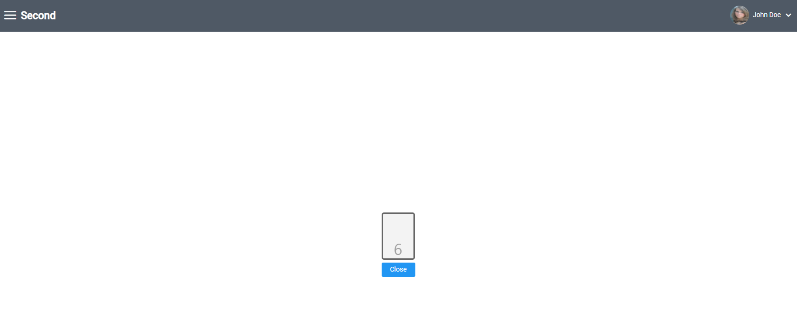
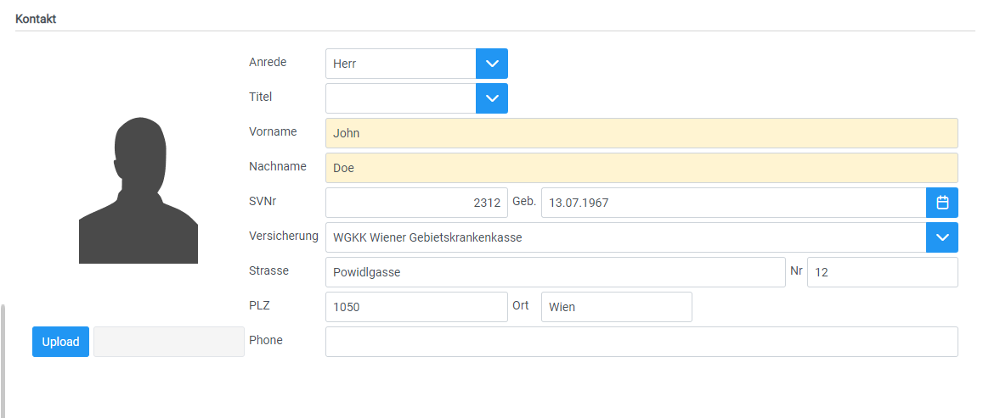
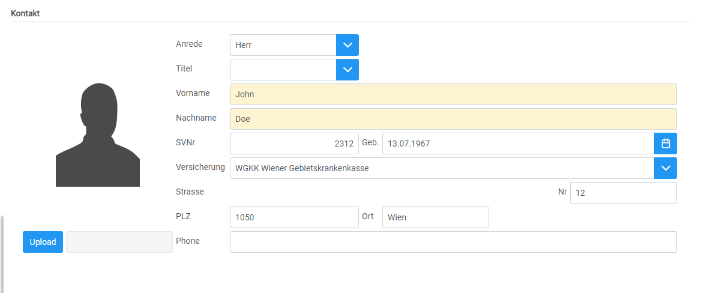

# Custom-Components

## Overview
Custom-Components replace already existing components of a screen with your own react-coded components. The custom-components
will be at the same spot in the layout, as the components which got replaced. The size of the custom-component gets measured
and the layout will be adjusted.

Use custom-components if you want to add your react components, which aren't supported by swing to a screen of your application.

## Implementation

1. Add an array for your custom-components (type CustomComponentType[]).

```typescript
  const customComponentsArray: CustomComponentType[] = [
    {
      name: "Sec-BL_B_DOOPEN", 
      component: <CustomCounter/>
    },
    {
      name: "Con-CG_E_contacts_STREET"
    }
  ];
```

### Custom-Screen Properties
Name | Type | Description
--- | --- | --- |
name | string | The name of the component you want to replace, can be found in VisionX.
component | ReactElement, undefined | The custom component added. Undefined if the component should be removed.

2. Add the array to your "ReactUI" component as property "customComponents" (The array from part 1 can be written directly into this property as well.)

```typescript
  return (
    <ReactUI customComponents={customComponentsArray} />
  );
```

## Example
For the first example I've replaced a button of a screen with a [react counter component](../../features/CustomCounter.tsx)

### Here is a screenshot of the screen before I've added the customComponents array



### When using the customComponents array



For the second example I've removed a text input from a screen using the "customComponents" array.

### Before removing


### After removing
