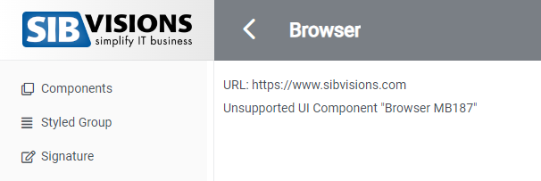

# Custom-Components

## 1. Adding Custom Components

## Overview
Custom-Components replace already existing components of a screen with your own react-coded components. The custom-components
will be at the same spot in the layout, as the components which got replaced. The size of the custom-component gets measured
and the layout will be adjusted.

Use custom-components if you want to add your react components, which aren't supported by swing to a screen of your application.

## Implementation

1. First you need to register a [screen-wrapper](src/readme-files/screen-wrapper) for the screen where the custom-component is placed. In the screen-wrapper create a variable which uses the ```useAPI``` hook to gain access to api-functions.

```typescript
const api = useAPI();
```

2. Define a function which will be passed as ```onOpen``` property to the screen-wrapper. In the function call the ```screen.addCustomComponent``` function.

### screen.addCustomComponent Parameters
Parameter | Type | Description
--- | --- | --- |
id | string | ID of the component you want to replace, can be found in VisionX.
component | ReactElement | The custom component which should be added.

```typescript
    const onOpen = () => {
        screen.addCustomComponent("Fir-N7_B_DOOPEN", <CustomCounter />)
    }
```

## Example
I've replaced a button of a screen with a [react counter component](../../features/CustomCounter.tsx)

### Here is a screenshot of the screen before I've added the custom-component


### When adding the custom-component


## Removing Custom-Components

## Overview
Removes a component from a workscreen. The layout will be adjusted to the removed component. Used if you want to remove existing components from VisionX to not see them in web.

## Implementation

1. The same as step 1 of adding custom-components above.

2. Define a function which will be passed as ```onOpen``` property to the screen-wrapper. In the function call the ```screen.removeComponent``` function.

### screen.addCustomComponent Parameters
Parameter | Type | Description
--- | --- | --- |
id | string | ID of the component you want to remove, can be found in VisionX.

```typescript
    const onOpen = () => {
        screen.removeComponent("Fir-N7_B_DOOPEN");
    }
```

## Example
### Before I removed a component


### After


## 2. Adding Global Components

## Overview
With global-components you are able to add your own component to replace all components, sent by the server with a specific classname. The global-components
will be at the same spot in the layout, as the components which got replaced. The size of the custom-component gets measured
and the layout will be adjusted.

The difference to custom-components is that you don't replace one specific component by name, but instead replace **all** components with that classname.

## Implementation
1. First in your "main" component (e.g. App.js) you will need to create a variable, which uses the useAPI hook to gain access to api-functions.
```typescript
const api = useAPI();
```
2. Then in a function which is passed to the ```ReactUI``` component. (e.g. onStartup, onLogin, onMenu), use the ```api.addScreenWrapper``` function. As first parameter pass the classname of the components you want to replace, as second parameter pass the component you want to replace it with.

```typescript
  const onLogin = () => {
     if (api.getUser().userName === "admin") {
      api.addGlobalComponent("MobileBrowser", <CustomBrowser />);
    }
  }
```

## Example
In my exmaple the server sends a component with the classname "MobileBrowser", this type of component isn't supported in the ```ReactUI```. The implemented component is just a simple iframe which uses the url the server sends.

### Before


### After
