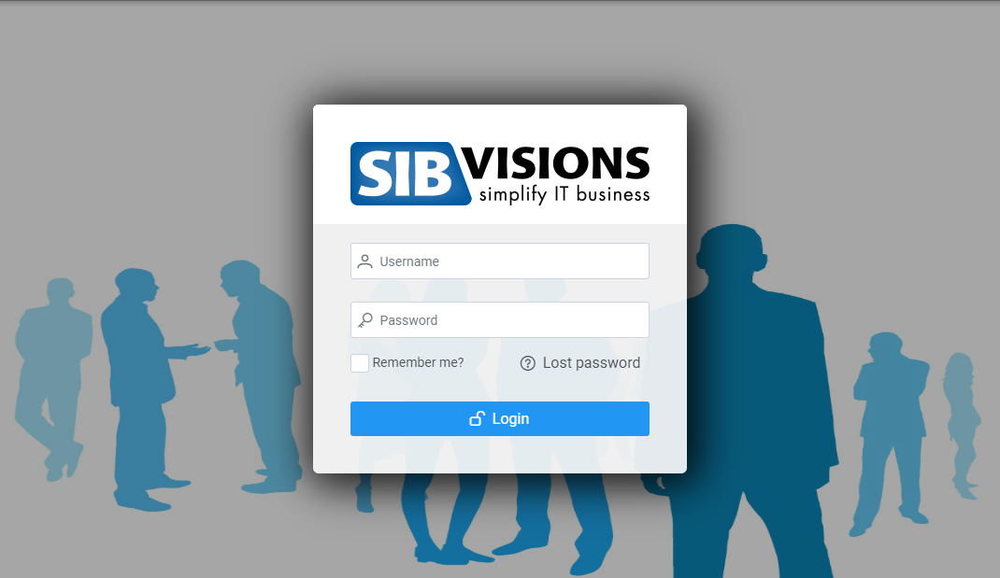
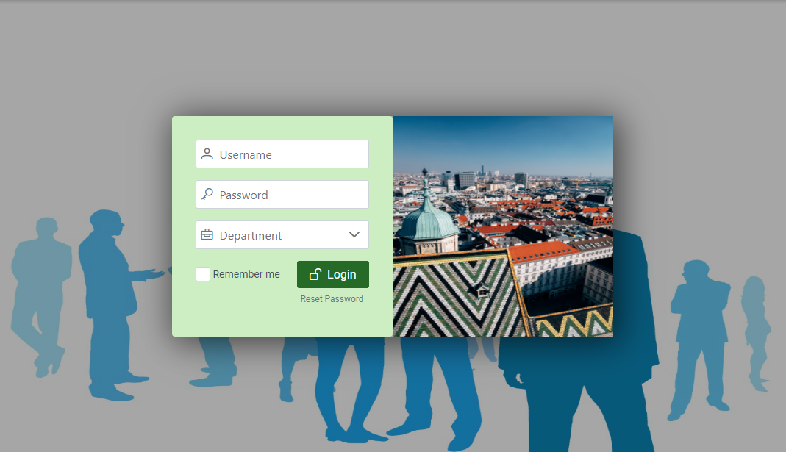
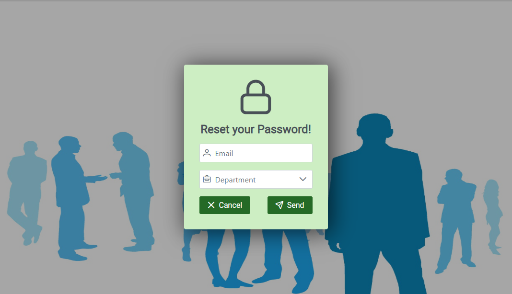

# Custom-Login

## Overview
You are able to replace the default login-masks, with your custom-login masks for each login-mode. It is possible to just replace specific mode's so not every mask has to be implemented.

## Implementation
1. Create your custom login-mask component and write your own login-mask.

### Custom Login Mask Properties
Parameter | Type | Description
--- | --- | --- |
username | string | The currently entered username.
password | string | The currently entered password.
loginMode | "default", "reset", "mFTextInput", "mFWait", "mFURL" | The current login-mode used to decide which mask should be displayed
sendLoginRequest| (username: string, password: string, rememberMe?:boolean, options?:any) => void | A function which sends a login-request to the server, pass the username and the password, if you want add a remember me field for autologin. In the options field you can pass any additional parameters which the server should process.
sendResetRequest | (identifier: string, options?:any) => void | A function which sends a reset-password-request to the server, pass the identifier (e.g. email) and in the options field you can pass any additional parameters which the server should process.
setToDefaultLoginMode | () => void | Sets the loginMode to "default"
setToResetLoginMode | () => void | Sets the loginMode to "reset"

Source to an example custom-login-mask can be found [here](../../features/CustomLoginView.tsx).

2. In your main class (e.g. App.tsx) call the `api.addCustomLogin` function in a function, which will then be passed in the `onStartup` property used in the `ReactUI` component.

### api.addCustomLogin Parameters
Parameter | Type | Description
--- | --- | --- |
loginComponent | (props: ICustomLogin) => ReactElement | A function to render your custom login
useDefault | boolean, undefined | True, if the default login-mode should be replaced.
useReset | boolean, undefined | True, if the reset login-mode should be replaced.
useTextMFA | boolean, undefined | True, if the mFTextInput login-mode should be replaced.
useWaitMFA | boolean, undefined | True, if the mFWait login-mode should be replaced.
useURLMFA | boolean, undefined | True, if the mFURL login-mode should be replaced.

``` typescript
    const api = useAPI();

    const onStartup = () => {
        api.addCustomLogin((props) => <CustomLoginView {...props} />, true, true);
    }

    return (
        <ReactUI onStartup={onStartup} />
    );
```

### Example

#### **Before adding the Custom Login Mask**
Loginmode "default":


Loginmode "reset":


#### **After adding the Custom Login Mask**
Loginmode "default:
Loginmode "default":


Loginmode "reset":
