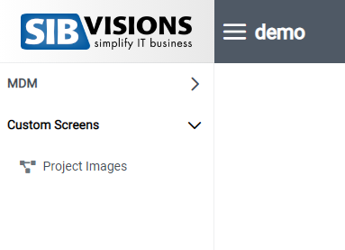
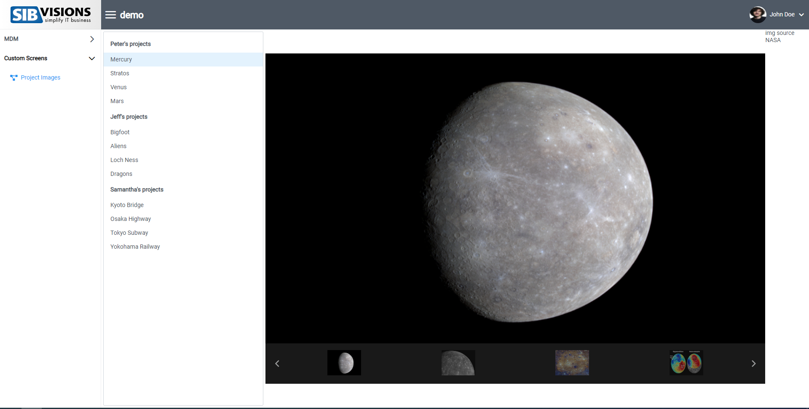

# Custom-Screens

## Overview
Custom-screens are a way to add your own react-coded screens, which aren't avaiable in VisionX, to your application.
Use custom-screens if you want to add screens to your web application, which are react only and don't need to work with the java applications server.

## Implementation
1. Add an array for your custom-screens (type CustomScreenType[], the same array as replace-screens).

```typescript
const customScreens: CustomScreenType[] = [
    {
      name: "Project Images",
      menuGroup: "Custom Screens",
      screen: <CustomProjectScreen />,
      icon: "pi-chart-line"
    }
  ];
  ```
### Custom-Screen Properties
Name | Type | Description
--- | --- | --- |
name | string | Name of the screen used for routing and gets displayed in the menu.
menuGroup | string | The menu-group the screen should be added into, if the menu-group isn't already added a new menu-group is created.
screen | ReactElement | The component you want to add as custom-screen.
icon | string, undefined | An icon which will be displayed in the menu. FontAwesome and PrimeIcon supported

2. Add the array to your "ReactUI" component as property "customScreens". (The array from part 1 can be written directly into this property as well.) 

```typescript
  return (
    <ReactUI customScreens={customScreens} />
  );
```
## Example
The custom-screen will be added to the menu-group specified.



Here is an example custom screen I added with components which are not available in VisionX! [Sources can be found here](../../features/CustomProjectScreen.tsx)

