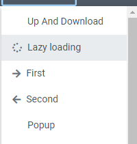
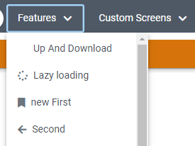
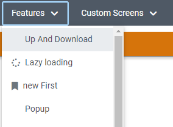

# Editing the Menu

## Overview
When you are using ReactUI as a library it's possible to edit or even remove menu-items you receive from the server. This is useful if you either want to change the title and icon of some menu-items or don't want to have some screens available in your web application, which would have been sent by the server.

## 1. Editing Menu-Items

## Implementation
1. Create a function which will be passed as ```onMenu``` to the ```ReactUI``` component. In this function call the ```api.editMenuItem``` function which will receive an object of type ```EditableMenuItem```.

### EditableMenuItem Properties
Property | Type | Description
--- | --- | --- |
id | string | The classname of the menu-item you want to edit. Can be found in VisionX
newTitle | string, undefined | The new title of the menu-item
newIcon | string, undefined | The new icon of the menu-item

### Editing Menu-Item Example
```typescript
  const onMenu = () => {
    if (api.getUser().userName === "features") {
      api.editMenuItem({
        id: "com.sibvisions.apps.mobile.demo.screens.features.FirstWorkScreen",
        newTitle: "new First",
        newIcon: "fa-bookmark"
      });
  }
```

In my example, I changed the menu-item of "First" to have "new First" as the new title and also changed the icon.

Before



After adding onMenu First will be changed



## 2. Removing Menu-Items

## Implementation
1. Create a function which will be passed as ```onMenu``` to the ```ReactUI``` component. In this function call the ```api.removeMenuItem``` function which will contain the className of the menu-item you want to remove.

## Removing Menu-Item Example

```typescript
  const onMenu = () => {
    if (api.getUser().userName === "features") {
      api.removeMenuItem("com.sibvisions.apps.mobile.demo.screens.features.SecondWorkScreen");
  }
```



Menu-Item "Second" has been removed.