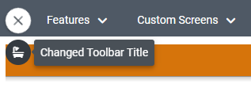
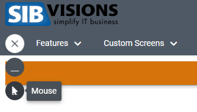
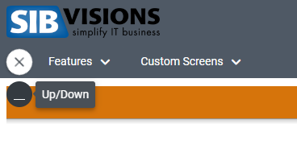

# Editing the Toolbar

## Overview
When using the application in "corporation" style mode it's possible to enable a toolbar and add screens to it, so you can navigate more quickly to these screens. When you are using ReactUI as a library it's possible to add, edit or even remove toolbar-items you receive from the server. This is useful if you either want to change the title and icon of some menu-items or don't want to have some screens available in your web application, which would have been sent by the server.

## 1. Adding Toolbar-Items

## Implementation
1. Create a function which will be passed as ```onMenu``` to the ```ReactUI``` component. In this function call the ```api.addToolbarItem``` function which will receive an object of type ```CustomToolBarItem```.

### CustomToolBarItem Properties
Property | Type | Description
--- | --- | --- |
id | string | The classname of the menu-item you want to edit. Can be found in VisionX
title | string, undefined | The new title of the menu-item
icon | string, undefined | The new icon of the menu-item

### Adding Toolbar-Item Example
```typescript
  const onMenu = () => {
    if (api.getUser().userName === "features") {
      api.addToolbarItem({
        id: "com.sibvisions.apps.mobile.demo.screens.features.PopupExampleWorkScreen",
        icon: "fa-bookmark",
        title: "Popup"
      });
  }
```


## 2. Editing Toolbar-Items

## Implementation
1. Create a function which will be passed as ```onMenu``` to the ```ReactUI``` component. In this function call the ```api.editToolbarItem``` function which will receive an object of type ```EditableMenuItem```.

### EditableMenuItem Properties
Property | Type | Description
--- | --- | --- |
id | string | The classname of the toolbar-item you want to edit. Can be found in VisionX
newTitle | string, undefined | The new title of the toolbar-item
newIcon | string, undefined | The new icon of the toolbar-item

### Editing Toolbar-Item Example
```typescript
  const onMenu = () => {
    if (api.getUser().userName === "features") {
      api.editToolbarItem({
        id: "com.sibvisions.apps.mobile.demo.screens.features.UpAndDownloadWorkScreen",
        newTitle: "Changed Toolbar Title",
        newIcon: "fa-bath"
      });
  }
```



## 3. Removing Toolbar-Items

## Implementation
1. Create a function which will be passed as ```onMenu``` to the ```ReactUI``` component. In this function call the ```api.removeToolbarItem``` function which will contain the className of the toolbar-item you want to remove. 

### Adding Toolbar-Item Example
```typescript
  const onMenu = () => {
    if (api.getUser().userName === "features") {
        api.removeToolbarItem("com.sibvisions.apps.mobile.demo.screens.features.MouseWorkScreen");
  }
```
Before removing the toolbar-item



After removing the toolbar-item

