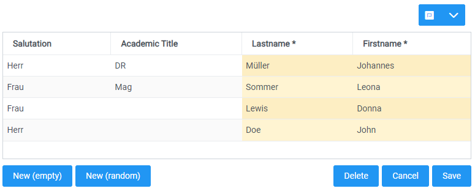
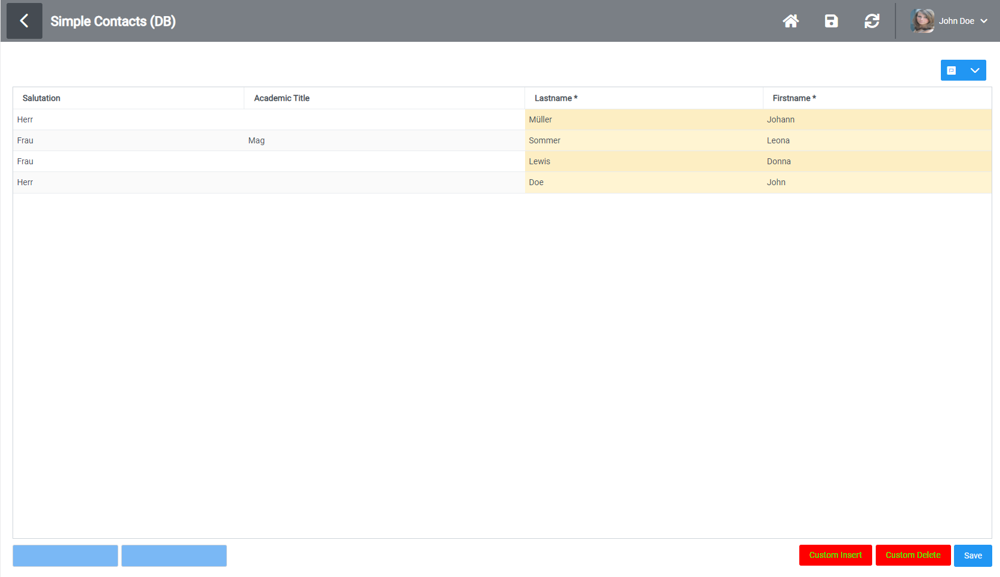
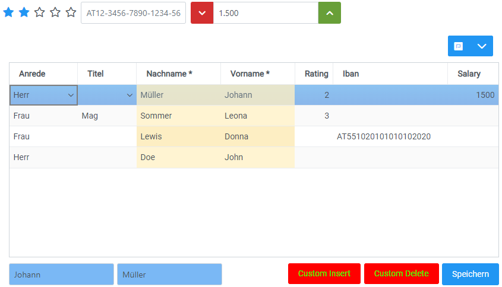
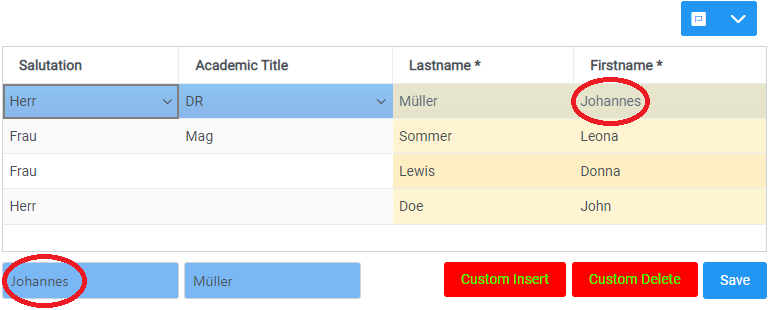
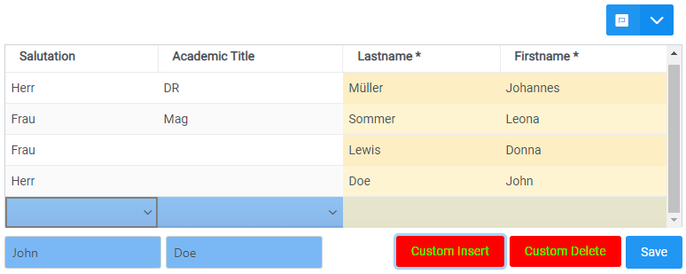

# Example-Screen
In this example-screen I'm going to use some customizing, API-functions, hooks and requests to use [custom-components](../custom-component/) to modify the data of the already existing screen of my VisionX-application.

## 1. Customize the screen
Firstly we'll have to add the [screen-wrapper](../screen-wrapper) to the application, so there is an entrypoint to the workscreen, so it can be customized. In the onLogin function I'm going to add the screen-wrapper to the following screen, but only when the user "features" is logged in. The onLogin function has to be passed to the `<ReactUI />` component to work.
```typescript
    const onLogin = () => {
        if (api.getUser().userName === "features") {
            api.addScreenWrapper("SimCon-QQ", <ScreenWrapperExample />);
        }
    }
```

## 2. Creating the Screen-Wrapper
This is the template of the most basic screen-wrapper before anything has been added, it would just render the screen without adding anything:
```typescript
import { ScreenWrapper, useAPI } from "@sibvisions/reactui";
import React, { FC } from "react";

const ScreenWrapperExample:FC = (props) => {
    const api = useAPI();

    const onOpen = () => {
        
    }

    return (
        <ScreenWrapper onOpen={onOpen}>
            {screen => 
                <>
                    {screen}
                </>
            }
        </ScreenWrapper>
    )
}
export default ScreenWrapperExample
```

Here is a screenshot before all changes.



## 3. Creating the Custom-Components
We'll need to write some custom-components to add to the screen. I'll create a text-field and a button.

```typescript
const CustomTextField:FC = (props) => {
    const [text, setText] = useState<string>("")

    return (
        <InputText 
            value={text} 
            onChange={(event) => setText(event.currentTarget.value)}
            style={{ background: "#7ab8f5" }} />
    )
}

const CustomButton:FC<any> = (props) => {
    return (
        <Button 
            label={props.buttonLabel} 
            onClick={props.onClick} 
            style={{ background: "red", borderColor: "red", color: "#00ff00" }} />
    )
}
```

## 4. Replace existing-components with your custom-components
Now we need to get the names of the existing-components and replace them with our custom-components in the onOpen function.

```typescript
    const onOpen = () => {
        api.addCustomComponent("SimCon-QQ_B_DOINSERTEMPTY", <CustomTextField />);
        api.addCustomComponent("SimCon-QQ_B_DOINSERTRANDOM", <CustomTextField />);
        api.addCustomComponent("SimCon-QQ_B_DELETE", <CustomButton buttonLabel="Custom Insert" />);
        api.addCustomComponent("SimCon-QQ_B_RESTORESELECTEDROW", <CustomButton buttonLabel="Custom Delete" />);
    }
```

Now the screen looks like this:



## 5. Adding external components into the screen-wrapper
A screen-wrapper isn't only there to create an entrypoint to the workscreen. We can also use it to add some components next to the workscreen. I've added three components, which aren't available in the ```ReactUI```.


## 6. Add the data-binding to our textfields and onClicks to buttons
Now for the data-binding we are getting the dataproviders using the `useDataProviders(props.screenName)` hook. Then we are going to pass the dataprovider and the columnName. For the buttons we are passing the onClick function, we are calling the `api.insertRecord` and `api.deleteRecord` function.

```typescript
    const dataProviders = useDataProviders(props.screenName);

    const onOpen = () => {
        api.addCustomComponent("SimCon-QQ_B_DOINSERTEMPTY", <CustomTextField screenName={props.screenName} dataProvider={dataProviders[4]} columnName={"FIRSTNAME"} />);
        api.addCustomComponent("SimCon-QQ_B_DOINSERTRANDOM", <CustomTextField screenName={props.screenName} dataProvider={dataProviders[4]} columnName={"LASTNAME"} />);
        api.addCustomComponent("SimCon-QQ_B_DELETE", <CustomButton buttonLabel="Custom Insert" onClick={ () => api.insertRecord(props.screenName, dataProviders[4]) } />);
        api.addCustomComponent("SimCon-QQ_B_RESTORESELECTEDROW", <CustomButton buttonLabel="Custom Delete" onClick={ () => api.deleteRecord(props.screenName, dataProviders[4]) } />);
    }
```

In the `CustomTextField` we are going to use the `useRowSelect` hook to get the currently selected row and we are going to add an useEffect hook to update our textfields text state whenever the selectedRow changes.

```typescript
    const CustomTextField:FC<any> = (props) => {
        const [selectedRow] = useRowSelect(props.screenName, props.dataProvider);

        const [text, setText] = useState<string>(selectedRow ? selectedRow.data[props.columnName] : "");

        useEffect(() => {
            setText(selectedRow ? selectedRow.data[props.columnName] : "")
        }, [selectedRow])

        return (
            <InputText 
                value={text} 
                onChange={(event) => setText(event.currentTarget.value)}
                style={{ background: "#7ab8f5" }} />
        )
    }
```

Now we can see at the bottom that the data is available in the textfields.


## 7. Editing the Fields and sending the changes to the Server
Now that we have access to the data, data-changes won't be sent to the server right now. For that we need to send a `SetValuesRequest` to the server by using the `createSetValuesRequest` function.

```typescript
    return (
        <InputText 
            value={text} 
            onChange={(event) => setText(event.currentTarget.value)}
            onBlur={() => {
                const setValuesReq = createSetValuesRequest();
                setValuesReq.columnNames = [props.columnName];
                setValuesReq.dataProvider = props.dataProvider;
                setValuesReq.values = [text];
                api.sendRequest(setValuesReq, REQUEST_KEYWORDS.SET_VALUES);
            }}
            style={{ background: "#7ab8f5" }} />
    )
```

### Result


The Buttons do their jobs aswell!


## Full Source
[Link to the complete source of the screen-wrapper](../../features/ScreenWrapperExample.tsx)