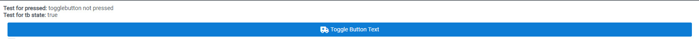
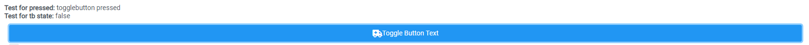

# Extending Components
## Overview
By extending existing components of a VisionX workscreen, you are able to execute your own code additionally, when the extendable events are called.

## Implementation
1. Add a [screen-wrapper](../screen-wrapper/) for the screen, which contains, the component you want to extend.

``` typescript
api.addScreenWrapper("Com-K3", <ScreenWrapperButton />)
```

2. In the screen-wrapper use the `useAPI` hook to gain access to the api function and declare an `onOpen` function. There call the `api.extendComponent` function and pass the name of the component, you want to extend and the respective component provided by the `ReactUI` lib, with an event passed as property. This event will then be called when the event is called.

3. Pass the `onOpen` function to the screen-wrapper.

## Example
In this example I'm extending a togglebutton's `onClick` and `onChange` event.

``` typescript
import React, { FC, useState } from "react";
import { useAPI, ScreenWrapper, UIToggleButton } from "@sibvisions/reactui"

const ScreenWrapperButton: FC<any> = (props) => {
    const [text1, setText1] = useState("not pressed")
    const [text2, setText2] = useState<boolean|undefined>(undefined)

    const api = useAPI();

    const onOpen = () => {
        api.extendComponent(
            "Com-K3_SP1_TB1", 
            <UIToggleButton
                onClick={(e) => {
                    setText1("togglebutton pressed")
                }}
                onChange={(value) => setText2(value)}
            />
        )
    }

    return (
        <ScreenWrapper onOpen={onOpen}>
            {screen =>
                <>
                    <div>
                        {"Test für pressed " + text1}
                        {" Test für tb state " + text2}
                    </div>
                    {screen}
                </>
            }
        </ScreenWrapper>
    )
}

```
### Before pressing the ToggleButton:
Before pressing the ToggleButton, you can see, that I've added 2 divs to the screen-wrapper. The first shows if the ToggleButton has already been pressed (onClick), the second one shows the current state of the ToggleButton (onChange, in this example is the default true).



After pressing the ToggleButton, we can see, that, the states have changed, the first state has been changed to "togglebutton pressed" and the onChange event returns the current state of the ToggleButton's selected state.



## List of Extendable Components
Here is a list of the components and their extendable events:

### Button
Event | Returns | Description
--- | --- | --- |
onClick | event: MouseEvent | Callback to invoke when the button is clicked

### Checkbox
Event | Returns | Description
--- | --- | --- |
onClick | event: SyntheticEvent | Callback to invoke when the Checkbox is clicked
onChange | checked: boolean | Callback to invoke when the Checkbox value changes

### Menubutton
Event | Returns | Description
--- | --- | --- |
onDefaultBtnClick | event: MouseEvent | Callback to invoke when the Defaultbutton (left) is clicked.
onMenuBtnClick | event: MouseEvent | Callback to invoke when the Menubutton (right) is clicked.
onMenuItemClick | clickedItem: string, <br /> originalEvent: SyntheticEvent | Callback to invoke when a menuitem has been clicked.

### Radiobutton
Event | Returns | Description
--- | --- | --- |
onClick | event: SyntheticEvent | Callback to invoke when the Radiobutton is clicked.
onChange | checked: boolean | Callback to invoke when the Radiobutton value changes.

### Togglebutton
Event | Returns | Description
--- | --- | --- |
onClick | event: SyntheticEvent | Callback to invoke when the Togglebutton is clicked.
onChange | selected: boolean | Callback to invoke when the Togglebutton value changes.

### Checkbox-CellEditor
Event | Returns | Description
--- | --- | --- |
onClick | event: SyntheticEvent | Callback to invoke when the Checkbox is clicked
onChange | value: string \| number \| boolean \| undefined, <br /> selectedValue: string \| number \| boolean \| undefined, <br /> deselectedValue: string \| number \| boolean \| undefined, | Callback to invoke when the Checkbox-Celleditor value changes

### Choice-Celleditor
Event | Returns | Description
--- | --- | --- |
onClick | event: SyntheticEvent | Callback to invoke when the Checkbox is clicked.
onChange | value: any, <br /> allowedValues: any[] | Callback to invoke when the Choice-Celleditor value changes.

### Date-Celleditor
Event | Returns | Description
--- | --- | --- |
onBlur | event: FocusEvent | Callback to invoke on blur event of input field.
onInput | event: KeyboardEvent | 	Callback to invoke on input event of input field.
onChange | value: Date \| undefined | Callback to invoke when the Date-Celleditor value changes.

### Image-Celleditor
Event | Returns | Description
--- | --- | --- |
onClick | event: SyntheticEvent | Callback to invoke when the Image is clicked.
onChange | - | Callback to invoke when the Image-Celleditor value changes.

### Linked-CellEditor
Event | Returns | Description
--- | --- | --- |
onBlur | event: FocusEvent | Callback to invoke on blur event of input field.
onChange | value: any | Callback to invoke when the Linked-Celleditor value changes.
onFilter | filterValue: string | Callback to invoke when filtering in the Linked-CellEditor
onSelect | value: any, <br /> originialEvent: SyntheticEvent | Callback to invoke when a suggestion is selected.
onLazyLoadFetch | records: any[] | Callback to invoke when the Linked-Celleditor is fetching new records

### Number-Celleditor
Event | Returns | Description
--- | --- | --- |
onBlur | event: FocusEvent | Callback to invoke on blur event of input field.
onInput | originalEvent: KeyboardEvent, <br /> value: number \| null | Callback to invoke on input event of input field.
onChange | value: number \| null \| undefined | Callback to invoke when the Number-Celleditor value changes.

### Text-Celleditor
Event | Returns | Description
--- | --- | --- |
onBlur | event: FocusEvent | Callback to invoke on blur event of input field.
onInput | originalEvent: ChangeEvent, <br /> value: string \| null | Callback to invoke on input event of input field.
onChange | value: string \| null \| undefined | Callback to invoke when the Text-Celleditor value changes.

### Icon
Event | Returns | Description
--- | --- | --- |
onChange | url: string \| undefined | Callback to invoke when the Icon URL changes.

### Label
Event | Returns | Description
--- | --- | --- |
onChange | value: string \| undefined | Callback to invoke when the Label changes.

### Map
Event | Returns | Description
--- | --- | --- |
onClick | originalEvent: MouseEvent, <br /> lat: number, <br /> lng: number | Callback to invoke when the map is clicked.
onDrag | centerLat: number, <br /> centerLng: number | Callback to invoke when the Map is being dragged.
onDragEnd |  centerLat: number, <br /> centerLng: number | Callback to invoke when the Map dragging has ended.
onSelectedMarkerChange | lat: number \| undefined, <br /> lng: number \| undefined | Callback to invoke whenever the Selected-Marker changes.
onZoomChange (Google only) | centerLat: number, <br /> centerLng: number | Callback to invoke when the Map zooming has ended.

### Popup
Event | Returns | Description
--- | --- | --- |
onDragStart | event: DragEvent | Callback to invoke when the Popup drag starts,
onDrag | event: DragEvent | Callback to invoke when the Popup is being dragged.
onDragEnd |  event: DragEvent | Callback to invoke when the Popup dragging has ended.
onClose | - | Callback to invoke when the Popup is being closed.

### Split-Panel
Event | Returns | Description
--- | --- | --- |
onResize | event: MouseEvent | Callback to invoke when the Split-Panel is being resized.
onResizeEnd | - | Callback to invoke when Split-Panel resizing has ended.

### Tabset-Panel
Event | Returns | Description
--- | --- | --- |
onTabChange | selectedIndex | Callback to invoke when a tab has been selected.
onTabClose | closedIndex: number | Callback to invoke when a tab has been closed.

### Table
Event | Returns | Description
--- | --- | --- |
onSort | sortDefinition: SortDefinition[] | Callback to invoke when a column of the Table is being sorted.
onColOrderChange | colOrder: string[] | Callback to invoke when the column-order is changed.
onColResizeEnd | event: DataTableColumnResizeEndParams | Callback to invoke when columns of a Table have been resized.
onLazyLoadFetch | records: any[] | Callback to invoke when the Table fetches data from the server
onRowSelect| originalEvent: DataTableSelectionChangeParams, <br /> selectedRow: any | Callback to invoke when the Tablerow changes.

### Password, Textfield and TextArea#
Event | Returns | Description
--- | --- | --- |
onBlur | event: FocusEvent | Callback to invoke on blur event of input field.
onChange | originalEvent: ChangeEvent, <br /> value: string \| null | Callback to invoke on input event of input field.

### Tree
Event | Returns | Description
--- | --- | --- |
onTreeChange | expandedKeys: TreeExpandedKeysType | Callback to invoke when the tree changes (expand etc.).
onRowSelect | originalEvent: TreeSelectionParams, <br /> selectedRow: any | Callback to invoke when the selected-row changes.
