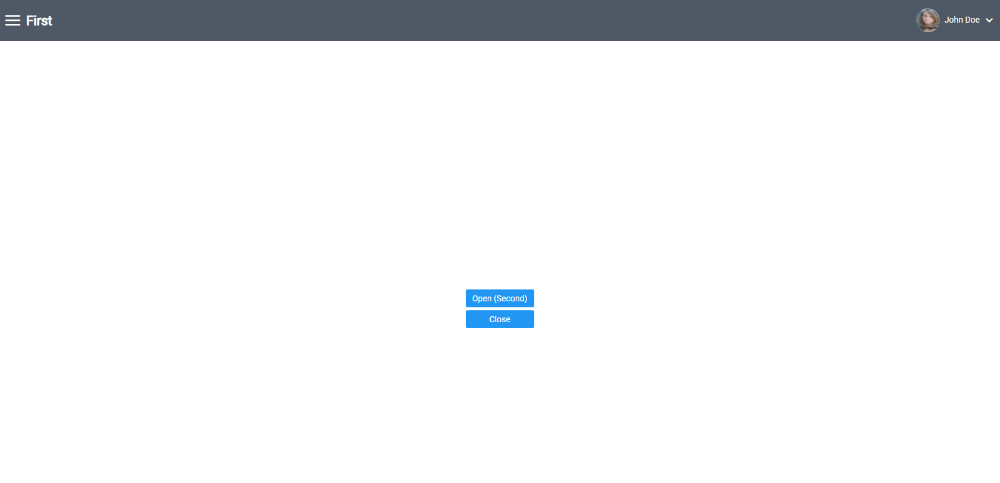
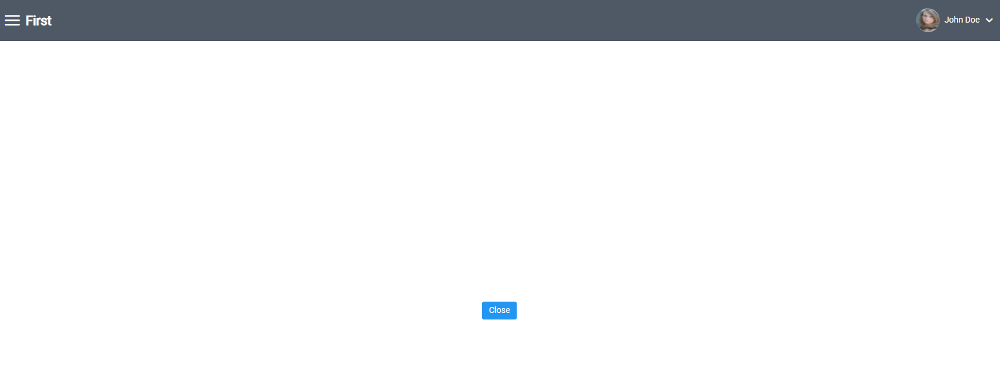

# Removing Components

## Overview
Removes a component from a workscreen. The layout will be adjusted to the removed component.
Used if you want to remove existing components from VisionX to not see them in web.

## Implementation
Call the "useRemoveComponent" hook in a screen-wrapper. Pass the name of the component, which can be found in VisionX, as parameter.

```typescript
    /** To remove a component from the workscreen, the component name is necesary and can be found in VisionX */
    useRemoveComponent("Fir-N7_B_DOOPEN");
```

## Example
### Before I removed a component



### After

