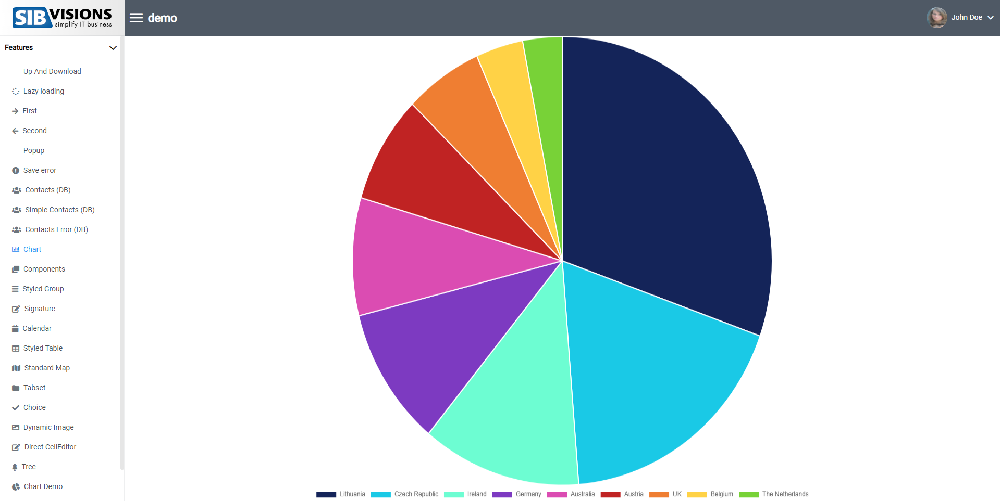

# Replace-Screens

## Overview
Replace-screens replace an already existing screen in VisionX with your own react-coded screen.
Use replace-screens to develop custom screens with react, while still being able to use the data of the replaced screen from your java application!

## Implementation
1. In your main class (e.g. App.tsx) call the ```api.addReplaceScreen``` function, in a function which will then be passed prefereably as ```onLogin``` to your ```ReactUI``` component, onStartup is also possible, but onLogin is preferred so you can check which user should receive the replace-screen.

### api.addReplaceScreen Parameters
Parameter | Type | Description
--- | --- | --- |
id | string | ID of the screen you want to replace. Has to be the same name of the screen in VisionX!
screen | ReactElement | The component you want to add as replace-screen.

```typescript
  const onLogin = () => {
    if (api.getUser().userName === "features") {
      api.addReplaceScreen("Cha-OL", <CustomChartScreen />);
    }
  }
```

### Using Data of a Replaced Screen
If your replace screen contains databooks you can use them in your replace-screen component.
Receive the name of the databooks by using the "useDataProviders" hook and pass the screenname as parameter.
```typescript
    /** Gets all dataproviders of a screen */
    const dataProviders = useDataProviders(props.screenName);
```
To get the data use the "useDataProviderData" hook and pass the screenname and one dataProvider as parameter.
```typescript
    /** Gets all data of a dataprovider  */
    const [data] = useDataProviderData(props.screenName, dataProviders[0]);
```

## Example
In my example I replaced the "Chart" screen of my demo and created my own chart with the data the server is sending.

In the menu I click the screen which has been replaced.


Here you can see my replace-screen. I am using the data provided by the java application to display my chart.



[Replace-screen source can be found here](../../features/CustomChartScreen).