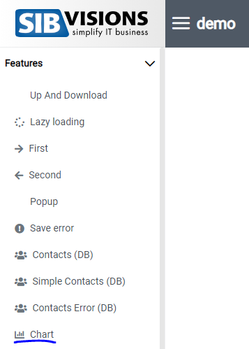

# Replace-Screens

## Overview
Replace-screens replace an already existing screen in VisionX with your own react-coded screen.
Use replace-screens to develop custom screens with react, while still being able to use the data of the replaced screen from your java application!

## Implementation
1. Add an array for your replace-screens (type CustomScreenType[], the same array as custom-screens).

```typescript
const replaceScreens: CustomScreenType[] = [
    {
      replace: true,
      name: "Cha-OL", 
      screen: <CustomChartScreen/>
    }
  ];
  ```
### Replace-Screen Properties
Name | Type | Description
--- | --- | --- |
name | string | Name of the screen you want to replace. Has to be the same name of the screen in VisionX!
screen | ReactElement | the component you want to add as replace-screen.
replace | boolean | Flag to indicate that a screen is being replaced.

2. Add the array to your "ReactUI" component as property "customScreens". (The array from part 1 can be written directly into this property as well. Custom-screens and replace-screens are mixed!) 

```typescript
  return (
    <ReactUI customScreens={replaceScreens} />
  );
```

### Using Data of a Replaced Screen
If your replace screen contains databooks you can use them in your replace-screen component.
Receive the name of the databooks by using the "useDataProviders" hook and pass the screenname as parameter.
```typescript
    /** Gets all dataproviders of a screen */
    const dataProviders = useDataProviders(props.screenName);
```
To get the data use the "useDataProviderData" hook and pass the screenname and one dataProvider as parameter.
```typescript
    /** Gets all data of a dataprovider  */
    const [data] = useDataProviderData(props.screenName, dataProviders[0]);
```

## Example
In my example I replaced the "Chart" screen of my demo and created my own chart with the data the server is sending.

In the menu I click the screen which has been replaced.



Here you can see my replace-screen. I am using the data provided by the java application to display my chart.


[Replace-screen source can be found here](../../features/CustomChartScreen).