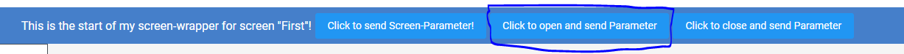
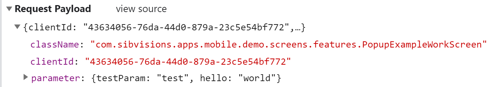
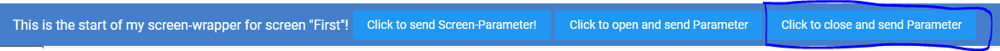
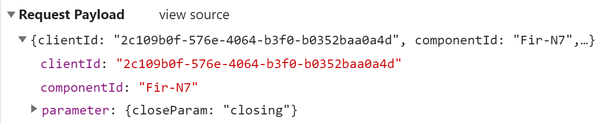
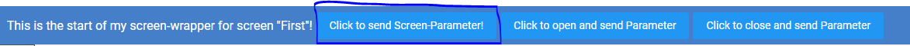
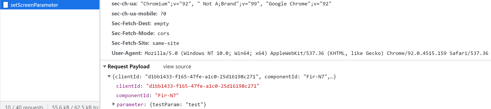

# Screen-Parameter

## Overview
Screen-Parameter are values which are sent to the server by the screen which can then be ue used in your java code.
They are used to send your own additional parameter, which aren't covered by the server and are based on your react screen, so you can check parameter in the java code which normally wouldn't be available.

You will be able to send screen-parameter during:

- opening a screen
- closing a screen
- anytime in a screen by calling the function sendScreenParameter

## Implementation

### 1. Sending parameters during openScreen
1. In a [screen-wrapper](src/readme-files/screen-wrapper) you are able to call the function ```api.sendOpenScreenRequest``` which will open a screen and can send screen-parameters. 

### api.sendOpenScreenRequest Parameters
Parameter | Type | Description
--- | --- | --- |
id | string | ID of the screen you want to open, can be found in VisionX.
parameter | { [key: string]: any } | The parameters to be sent.

### Example sending screen-parameter during openScreen
Here I've added the ```api.sendOpenScreenRequest``` to the ```onClick``` event of a button. So when I'm clicking the button, the new screen gets opened and the parameter will be sent.

```typescript
  <Button 
    onClick={() => api.sendOpenScreenRequest(
    "com.sibvisions.apps.mobile.demo.screens.features.PopupExampleWorkScreen", 
    { testParam: 'test', hello: 'world' })}
    style={{marginLeft: '5px'}}>
    Click to open and send Parameter
  </Button>
```



### 2. Sending parameters during closeScreen
1. In a screen-wrapper you are able to call the function ```api.sendCloseScreenRequest``` which will close a screen and send screen-parameters.

### screen.sendCloseScreenRequest Parameters
Parameter | Type | Description
--- | --- | --- |
parameter | { [key: string]: any } | The parameters to be sent.

### Example sending screen-parameter during closeScreen
Here I've added the ```screen.sendCloseScreenRequest``` to the ```onClick``` event of a button. So when I'm clicking the button, the screen gets closed and the parameter will be sent.

```typescript
  <Button 
    onClick={() => screen.sendCloseScreenRequest({ closeParam: 'closing' })}
    style={{marginLeft: '5px'}}>
    Click to close and send Parameter
  </Button>
```





### 3. Send Screen-Parameter in Screen-Wrapper
In your screen-wrapper component, use the useScreen hook to gain access to the ```screen.sendScreenParameter``` function then you can call it whenever to send the screen-parameter to the server.

### screen.sendScreenRequest Parameters
Parameter | Type | Description
--- | --- | --- |
parameter | { [key: string]: any } | The parameters to be sent.

### Example sending screen-parameter
Here I've added the ```screen.sendScreenRequest``` to the ```onClick``` event of a button. So when I'm clicking the button, parameter will be sent.

```typescript
  <Button 
    onClick={() => screen.sendScreenParameter( { testParam: 'test' })}
    style={{marginLeft: '5px'}}>
    Click to send Screen-Parameter!
  </Button>
```


