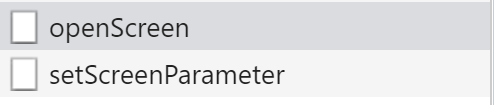
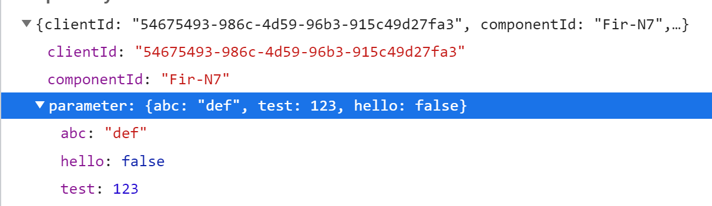

# Screen-Parameter

## Overview
Screen-Parameter are values which are sent to the server by the screen which can then be ue used in your java code.
They are used to send your own additional parameter, which aren't covered by the server and are based on your react screen, so you can check parameter in the java code which normally wouldn't be available.

You will be able to send screen-parameter during:

- opening a screen
- closing a screen
- anytime in a screen by calling the function sendScreenParameter

## Implementation

### 1. On Opening- and Closing Screen
1. Add an array for your screen-parameter (type CustomScreenParameter[])

```typescript
  const screenParameter: CustomScreenParameter[] = [
    {
      name: "Fir-N7",
      parameter: {
        abc: "def",
        test: 123,
        hello: false
      }
    },
    {
      name: "Sec-BL",
      parameter: {
        wyz: "tuv",
        tset: 789,
        bye: true
      },
      onClose: true
    }
  ]
```

### Screen-Parameter Properties
Name | Type | Description
--- | --- | --- |
name | string, string[] | Name(s) of the screen(s) where the screen-parameter are sent. Has to be the same name of the screen in VisionX!
parameter | object | An object containing the screen-parameter.
onClose | boolean | Flag to indicate whether to send the screen-parameter when the screen is opening or closing.

2. Add the array to your "ReactUI" component as property "customScreenParameter". (The array from part 1 can be written directly into this property as well) 

```typescript
  return (<ReactUI customScreenParameter={screenParameter} />);
```

### 2. Send Screen-Parameter in Screen-Wrapper
In your screen-wrapper component, use the useAPI hook to gain access to the sendScreenParameter function then you can call it whenever to send the screen-parameter to the server.

sendScreenParameter(screenName:string, parameter:[key:string]:any)
screenName: the name of your screen (props.screenName).
parameter: the parameter object like above.

## Example

### OpenScreen CloseScreen
After I've added the array from the "Implementation" part to my ReactUI component I open the screen "First". The setScreenParameter request is being sent to the server




The process for closeScreen is practically the same.

### In a Screen-Wrapper
I've added a button to my [screen-wrapper example](../../features/ScreenWrapperFirst.tsx) which will send screen-parameter on click.
```typescript
<Button 
    onClick={() => api.sendScreenParameter(props.screenName, { testParam: 'test' })}
    style={{marginLeft: '5px'}}>
    Click to send Screen-Parameter!
</Button>
```