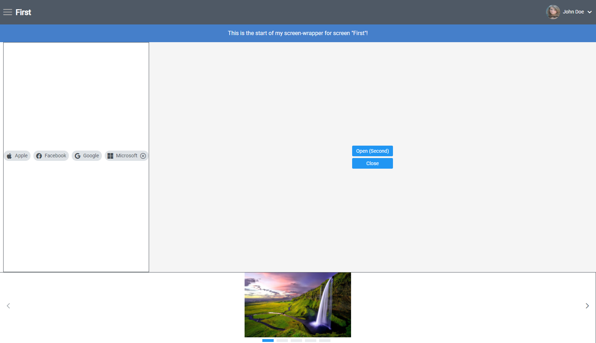
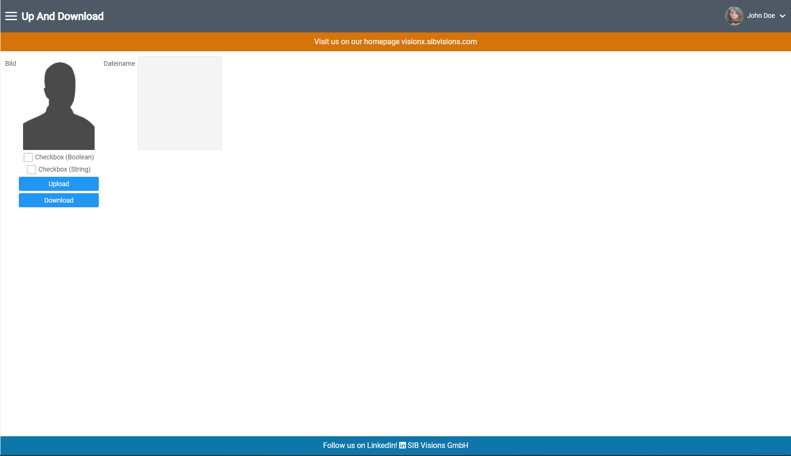
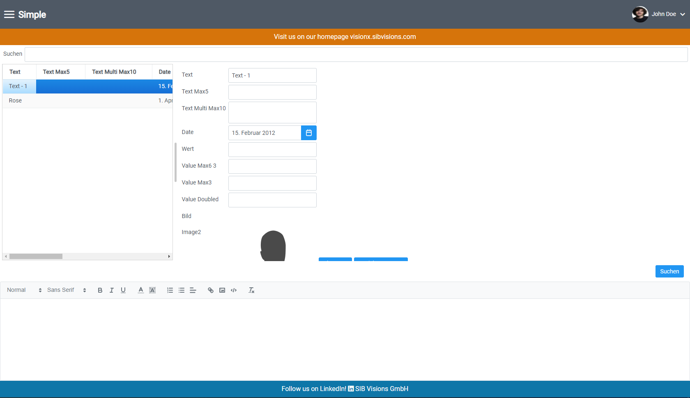

# Screen-Wrappers

## Overview
Screen-wrapper are used to display your own react code which wraps the workscreen. 

Without a screen-wrapper, the workscreen takes up all available space of the "main" screen. 

With a screen-wrapper the "main" screen will display your code
and the workscreen will fill the remaining size.

Use screen-wrappers if you want to display some of your own components as well as the workscreen of your application.

There are two modes for screen-wrappers.

1. global: displays the screen-wrapper on every screen
2. non-global: only displays the screen-wrappers on the given screens, single screen or multiple screens possible. (string, string[])

## Implementation

1. Add an array for your screen-wrappers (type ScreenWrapperType[]).

```typescript
  const screenWrapperArray: ScreenWrapperType[] = [
    {
      screen: "global",
      wrapper: <GlobalScreenWrapper/>,
    },
    {
      screen: "Fir-N7",
      wrapper: <ScreenWrapperFirst/>,
      options: { global: false }
    },
    {
      screen: ["Sim-SH", "Sec-BL"],
      wrapper: <ScreenWrapperSimple/>
    }
  ]
```

### Screen-Wrapper Properties
Name | Type | Description
--- | --- | --- |
screen | string, string[] | The name of the screen(s) you want to have wrapped.
wrapper | ReactElement | The screen-wrapper you want to display.
options | {global:boolean} | Currently only global attribute. If true, the global screen-wrapper gets displayed. If false, only the screen-wrapper for this screen gets displayed.

2. Add the array to your "ReactUI" component as property "screenWrappers" (The array from part 1 can be written directly into this property as well).

```typescript
  return (
    <ReactUI screenWrappers={screenWrapperArray} />
  );
```

### In your Wrapper Component
Wrap your JSX code with the inported ScreenWrapper component. 

Then use curly brackets to use the screen parameter. Place the screen parameter
where you want to have the workscreen. See code snippet for more details.

[Check out an example](../../features/ScreenWrapperFirst.tsx)

Note: For styling you may need to work with flexboxes.

## Example

### Non-global Screen-Wrapper
For my example I wrapped my screen in quite a bit of my own JSX. First a screenshot of before:


For demonstrational purposes I've added borders around the divs which are wrapping the workscreen to show, how big the workscreen is in the end, those are normally not there. I've also changed the background a little bit so it is more visible that the workscreen will take the remaining available space.


### Global Screen-Wrapper

When a global screen-wrapper is implemented, it is displayed on all screens except for screens which also have screen-wrappers and have as an option "global: false".

Here the orange and the blue bars are the global screen-wrapper.





Here you can see a screen-wrapper (the HTML Editor at the bottom) and the global screen wrapper wrapped around it. This happens when the global option is true on another screen-wrapper



[Global screen-wrapper source](../../features/GlobalScreenWrapper.tsx).

[Screen-wrapper-First](../../features/ScreenWrapperFirst.tsx).

[Screen-wrapper-Simple](../../features/ScreenWrapperSimple.tsx).